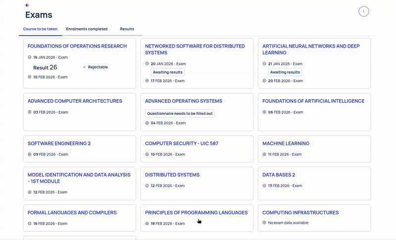
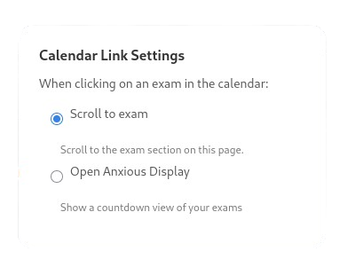

# Polimi Exam Calendar Browser Extension


[](https://addons.mozilla.org/en-GB/firefox/addon/polimi-exam-calendar/)
[](https://github.com/frephs/polimi-exam-calendar/releases/latest)


A browser extension that adds a calendar view for exams to the Polimi exam page.

## Demo 



### Popup action:


## Features
- **Calendar View**: Displays exams in a calendar format.
- **ICS Export**: Allows exporting the exam schedule as an ICS file for integration with other calendar applications.
- **Popup Interface**: Choose between scrolling to the exam section or opening a countdown to the exam on [the anxious display](https://the-anxious-display.vercel.app/). 


## Download and Installation
[](https://addons.mozilla.org/en-GB/firefox/addon/polimi-exam-calendar/)
[](https://github.com/frephs/polimi-exam-calendar/releases/latest)


Since the Chrome Web Store insertions are paid, the extension is available for one-click installation only in the Firefox Add-ons store.

Download the extension from the [Releases page](../../releases) or the [Firefox Add-ons page](https://addons.mozilla.org/en-GB/firefox/addon/polimi-exam-calendar/).

### Manual Installation

To manually install the extension, follow these steps:

#### Chrome/Edge:
1. Download the latest release `.zip` file.
2. Open Chrome/Edge and go to `chrome://extensions/`.
3. Enable "Developer mode" in the top right corner.
4. Click "Load unpacked" and select the extracted `dist/` directory.

#### Firefox:
1. Download the latest release `.zip` file.
2. Open Firefox and go to `about:debugging`.
3. Click "This Firefox" in the sidebar.
4. Click "Load Temporary Add-on" and select the extracted `dist/manifest.json` file.


## Development Setup and Contributing

Install dependencies:
   ```bash
   npm install
   ```

## Build Commands

### Development Build
```bash
npm run build:dev
```
Creates a development build with source maps in the `dist/` directory.

### Production Build
```bash
npm run build
```
Creates an optimized production build in the `dist/` directory.

### Watch Mode
```bash
npm run watch
```
Automatically rebuilds when files change (useful during development).

### Clean Build
```bash
npm run clean
```
Removes the `dist/` directory.

### Test Extension
```bash
npm run start
```
Builds the extension in development mode and launches it in a temporary Firefox profile.

### Package Extension
```bash
npm run package
```
Creates a production build and packages it as a `.zip` file in the `web-ext-artifacts/` directory.

### Lint
```bash
npm run lint
```
Lints the built extension using web-ext.

## Project Structure

```
├── src/
│   ├── content_script.ts      # Main TypeScript content script
│   └── styles.css             # Extension styling
├── icons/                     # Extension icons
├── manifest.json              # Extension manifest
├── dist/                      # Built extension (generated)
└── web-ext-artifacts/         # Packaged extensions (generated)
```

## Installation for Development

1. Build the extension: `npm run build:dev`
2. Open your browser's extension management page
3. Enable "Developer mode"
4. Click "Load unpacked" and select the `dist/` directory

## Installation for Production

1. Package the extension: `npm run package`
2. Install the generated `.zip` file from `web-ext-artifacts/`

## Releases

### Creating a Release

This project uses automated GitHub Actions for releases. You can create a release in several ways:

1. **GitHub Actions (Recommended):**
   - Go to Actions → "Create Release" → "Run workflow"
   - Choose version type (patch/minor/major) and optional release notes

2. **NPM Scripts:**
   ```bash
   npm run release:patch   # Bug fixes (1.0.0 → 1.0.1)
   npm run release:minor   # New features (1.0.0 → 1.1.0)
   npm run release:major   # Breaking changes (1.0.0 → 2.0.0)
   ```

3. **Manual Git Tags:**
   ```bash
   git tag v1.2.3
   git push origin v1.2.3
   ```

See [RELEASE.md](RELEASE.md) for detailed release instructions.


## Contributing
Contributions are welcome! Please read the [CONTRIBUTING.md](CONTRIBUTING.md) for details on how to contribute.